<h1 align="center" style="border-bottom: none;">:rocket: IBM Watson Assistant  Tutorial</h1>
<h3 align="center">In this hands-on tutorial you will create a new IBM Watson Assistant Service on the IBM Cloud and deploy your service with a Node.js app</h3>

## Prerequisites

1. Sign up for an [IBM Cloud account](https://cloud.ibm.com/registration).
2. Fill in the required information and press the „Create Account“ button.
3. After you submit your registration, you will receive an e-mail from the IBM Cloud team with details about your account. In this e-mail, you will need to click the link provided to confirm your registration.
4. Now you should be able to login to your new IBM Cloud account ;-)

## Configuring the Watson Assistant on the IBM Cloud

<h4>1) Create a Watson Assistant Service</h4>
After the login you will see your IBM Cloud Dashboard. In the upper menu bar click Catalog. In the Catalog section, click on the AI category, then select Watson Assistant. On the next page select the Lite Plan - or the Plus Trial - these should cover all deployment options and you can also choose a region, where you would like to deploy your service as well as a service name. Click "Create".

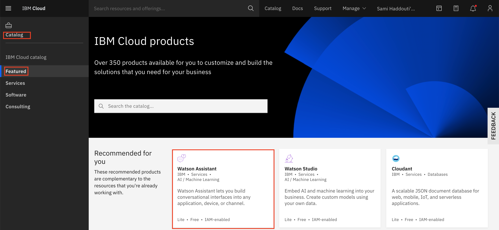

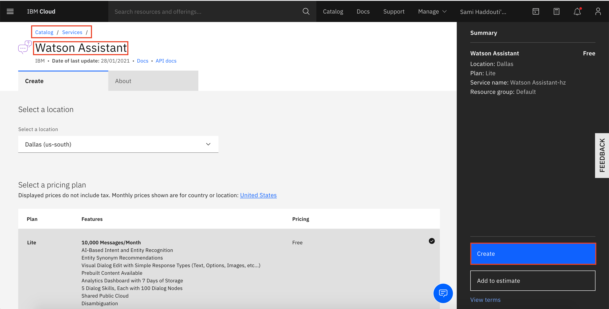

 
<h4>2) Access your Watson Assistant Service</h4>
Go back to your IBM Cloud Dashboard by clicking the IBM Cloud Logo on the upper left. Under services you will find the Watson Assistant Service in the corresponding region. Access your service by launching it. Afterwards click on Skills in the menu on the left and create a new Dialog skill. You have to set the language of your assistant or chatbot.

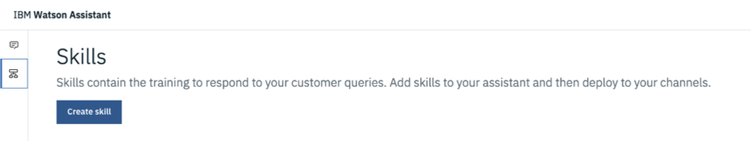

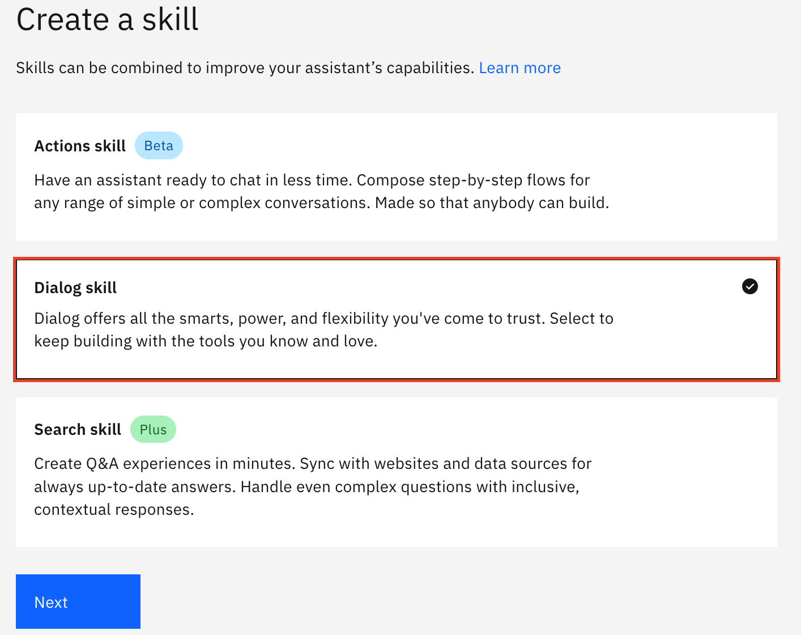

## Create Intents, Entities and the Dialog

The next step is to build your conversation. You can choose to build a customer service assistant, an assistant for your E-commerce, a company internal assistant or any other chatbot application of your choice. The three elements to consider are Intents, Entities and the Dialog.
<ul>
  <li><strong>Intents</strong> define a user's goal or purpose. Per intent you can configure various user examples. An example of an intent could be #Price and user examples could be “How much does it cost?” and “What is the price?”</li>
<li><strong>Entities</strong> handle significant parts of an input that should be used to alter the way the assistant responds to the intent. An example of an entity could be @products with the entity values “juice” and “water”.</li>
<li><strong>Dialog</strong> consists of dialog nodes. Each node is made up of a trigger (condition) and a response. If the assistant recognizes the intent #Price, it could then respond: Would you like to know the price of juice or water? Otherwise, if the assistant recognizes the intent #Price and the entity value @products is juice, it could then respond: The price of juice is 2€ per bottle.</li>
</ul>

<h4>1) Intents</h4>

Click "Create intent". You can create a first intent `#Greeting` and define user examples, such as "Hello", "Good morning", "Good day", "Hey there", and "Hi, how are you?".

You can create further intents for your conversation, such as:

`#Capabilities`
User examples: "What can you do?", "How can you help me?", "How can I use you?", ... .

`#Locations`
User examples: "Where is your store?", "What is your location?", "Where can I find your store?", ... .

`#Opening_Hours`
User examples: "When is your shop open?", "When is your store open?", ... .

`#Offerings`
User examples: "What are your offerings?", "Do you have any offerings?", "What can you offer me?", ... .

`#Purchase`
User examples: "I would like to buy", "I would like to purchase", "Can I buy", "Can I purchase", "I want to order", ... .

`#Goodbye`
User examples: "Bye bye", "Goodbye", "Catch you later", "See you", "Have a nice day", ... .

You can add further intents if you wish your assistant to handle more user requests.

<h4>2) Entities</h4>

Go to the entity section on the left-hand side and click "Create entity". You can create a first entity `@bicycle` and define values, such as "Mountainbike", "Citybike" and "E-Bike" and add synonyms for each value.

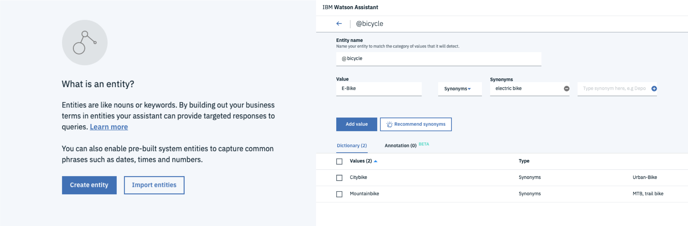

You can create further entities for your conversation, such as:

`@bell`
Values: "Noisy", "Silent", ... .

`@delivery`
Values: "Standard delivery", "Express delivery", ... .

`@payment_method`
Values: "Credit card", "PayPal", "Invoice", ... .

You can add further entities again.

<h4>3) Dialog</h4>
Go to the dialog section and you will see two dialog nodes, the Welcome and the Anything else node. Click on the Welcome node and change the welcome message. You can see that each node can be given a name. For the Welcome node the name is Welcome and the condition is "If assistant recognizes welcome" and the response is defined under "Assistant responds". You can create a new node by clicking the "Add node"-button or by clicking the 3 dots on each node and selecting add node above or below. You can also add child nodes that belong to one "parent"-node or a folder for instance to store your Smalltalk-nodes.

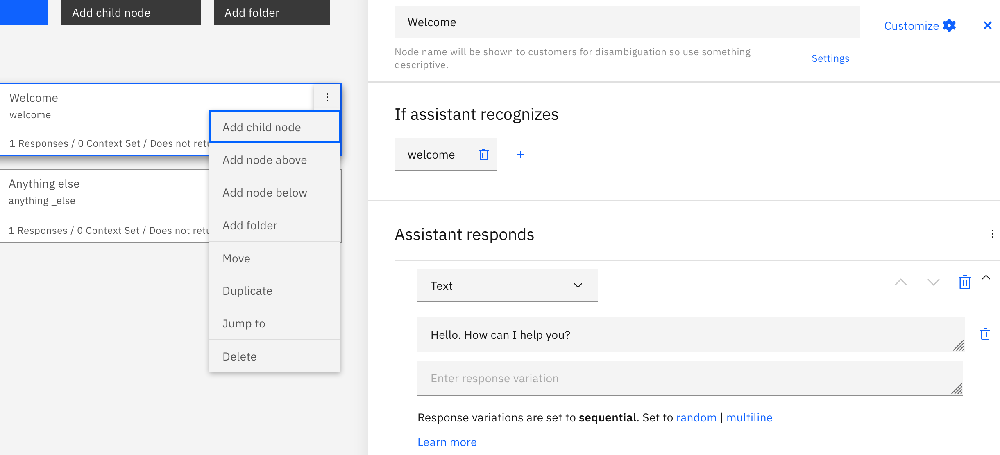

After editing the welcome message create a new node with the name Greeting. Define the condition: "If assistant recognizes `#Greeting` Assistant responds, then type your message, for instance "How can I help you?".

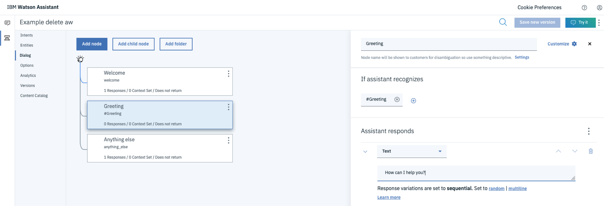

Moreover, you can create dialog nodes for the other intents `#Capabilities`, `#Locations`, `#Opening_Hours` and `#Goodbye`. Define answers for your assistant again, for instance for the intent `#Capabilities`: "I can tell you our shop locations, opening hours or help you buy one of our current offerings."

Afterwards create a dialog node for the intent `#Offerings`, but instead of the assistant responding a simple text, select Assistant responds with "Option". Therefore, you can configure your option list. In the Title input field write: These are our offerings, which one would you like to buy? Create 3 List Labels - these will be displayed as clickable options - for each bike. In the Value input field write "I would like to purchase the E-Bike", or "Mountainbike", or "Citybike" respectively.

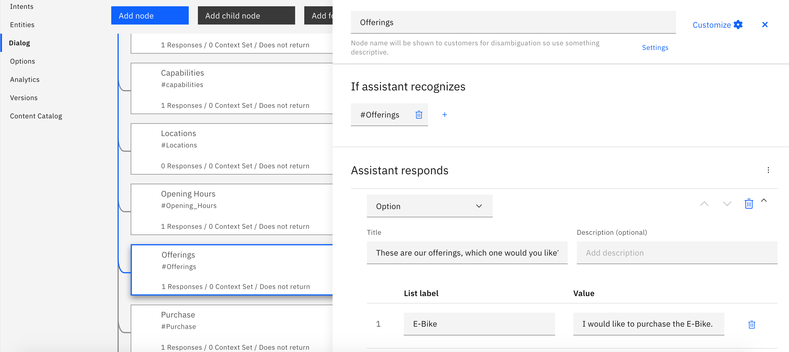

In the next step create a dialog node for the intent `#Purchase`. Click on the "Customize"-button on the upper right and enable Slots in the pop-up window by clicking the "turn on"-switch and finally click "Apply". Check for the 4 entities you created earlier `@bicycle`, `@bell`, `@delivery` and `@payment_method`. As an operator select "any". Context variables such as "$bicycle" will be created automatically in the "Save it as"-input field. Then write a text in the "If not present, ask"-input field and ask the user about the entity and make sure to mention the options, for instance: "Which bike would you like to buy? The Citybike, Mountainbike or E-Bike?".

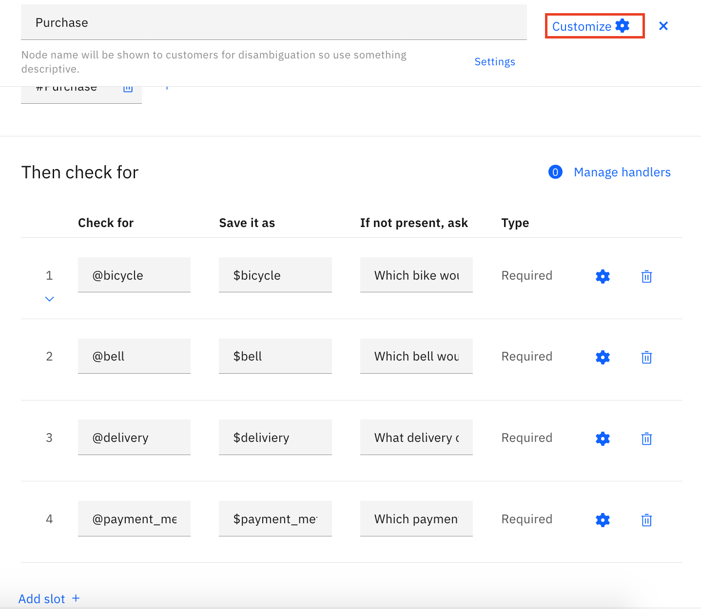

Below the slots write a purchase summary. Therefore write a text under assistant responds, for instance: "Excellent choice! Your purchase summary: $bicycle with $bell bell. Delivery: $delivery. Payment via $payment_method. Expect your $bicycle in 2-5 business days. Thank you!". Be careful to use the right context variables, which you set up in your slots.

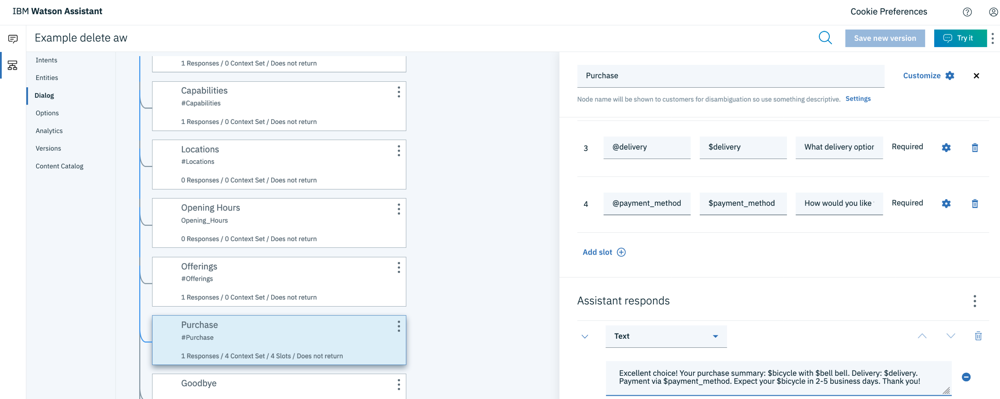

Finally you can test your assistant by clicking the "Try-it"-button on the upper right. You can talk to your assistant, clear the text and take a look at the context variables it saves during the conversation.

If you encounter issues with the intents and responses try deleting the Anything Else node in the Dialog section.

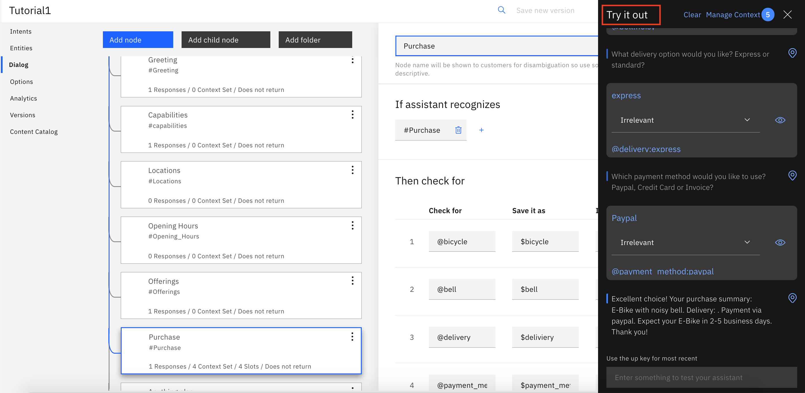

## Deploy the Watson Assistant

<h4>Deployment Option 1) Preview Link</h4>
To deploy your assistant click on Assistants, then click on create assistant and give your integration a name. Make sure the "Enable Preview Link" checkbox is checked. Then click on add a dialog skill to select your previously configured dialog skill. Afterwards go to the Preview Link and visit the provided URL. You can now talk to your Assistant :-)

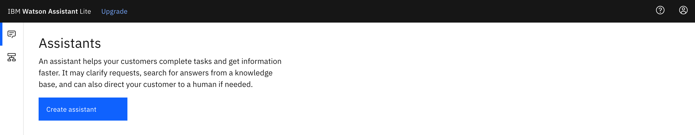

The Preview Link Chat App will look like this: 

The following video explains the process including the deployment option regarding the Preview Link:

 
<h4>Deployment Option 2) Web Chat</h4>
This deployment option works with the Lite Plan. Click the "Add Integration" button and choose Web Chat. You can customize the UI for your chatbot under "Style", use further features like Home Screen, Live Agent, etc. and generate a code snippet under "Embed", which you can copy and paste.

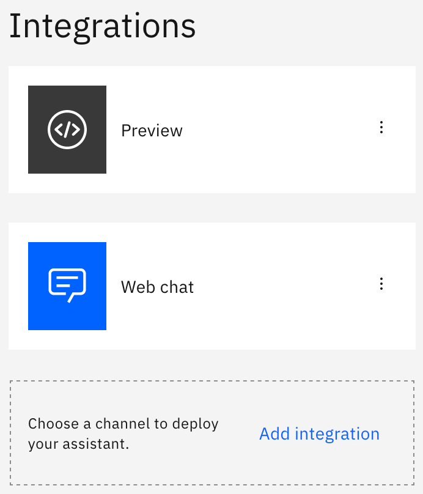

The following video explains the process including the deployment option regarding the Web Chat: [IBM Watson Assistant: Web Chat](https://youtu.be/52bpMKVigGU)

 
<h4>Deployment Option 3) Custom App on the IBM Cloud</h4>
Navigate to the IBM Cloud and search Cloud Foundry in the Catalog. Create a Public Application and select SDK for Node.js. Then fill in the required information. Best Practice is to use hyphens and not leave spaces, for instance for App and Host name.

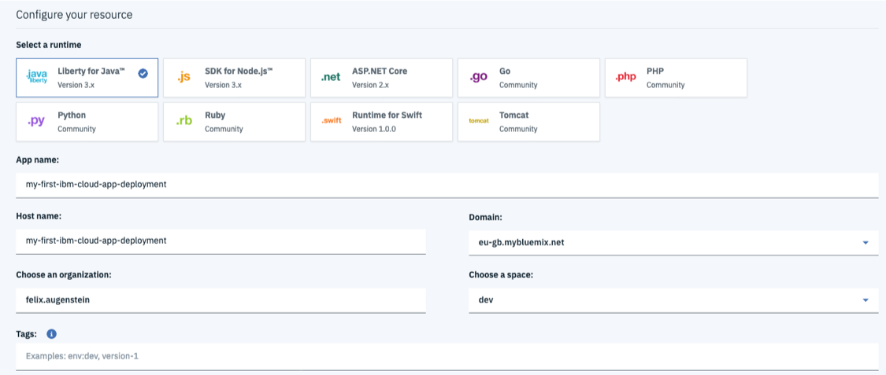

On the overview page enable continuous delivery and create a Toolchain Name. Remeber best practice is to use hyphens and not leave spaces. If you already have a Repository on GitHub select existing and provide the Repository-URL. If you don't have a repository yet, you can clone this one.

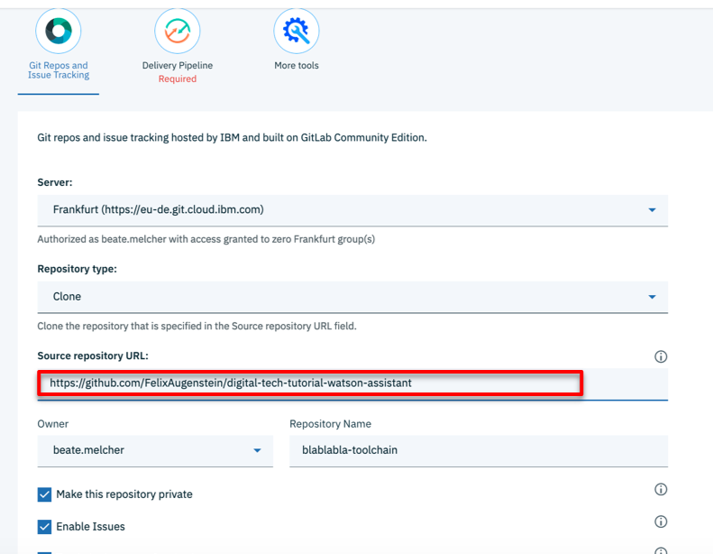

You may have to create a new IBM Cloud-API-Key, which you can save somewhere. You may be required to provide it later.

After cloning the GitHub Repository you will see the toolchain overview.

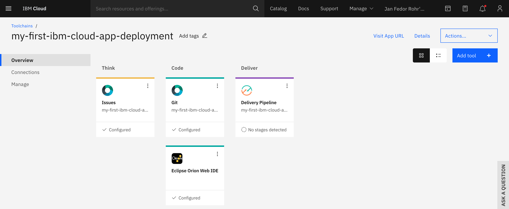

Click on Git in the middle to edit the code files. In your GitHub Repository update the app.js file and enter your Skill ID under `var workspace`. You can find you Skill ID in the Watson Assistant Service in the IBM Cloud. Click the three dots in the upper right and select View API Details. After updating the app.js file save it again. You may also be required to update the `name` and `host` in the manifest.yml. Make sure to provide a unique name and host.

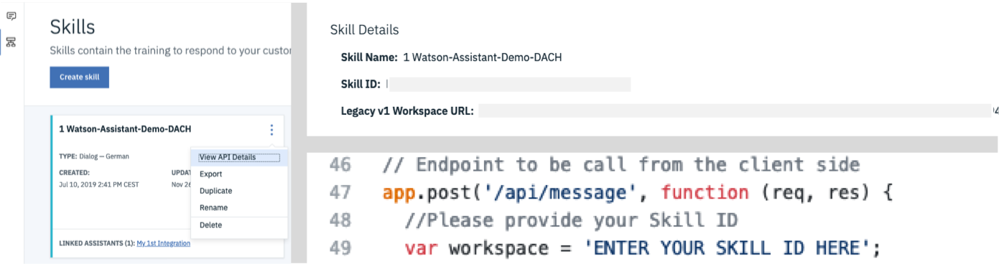

Then go back to your Cloud Foundry App and Create a new connection. Select the Service you want to connect with, in this case it is the Watson Assistant Service you created earlier. For Access Role and Service ID select Manager and Auto Generate. You will have to restage the app.

Your final App should look similar to this:
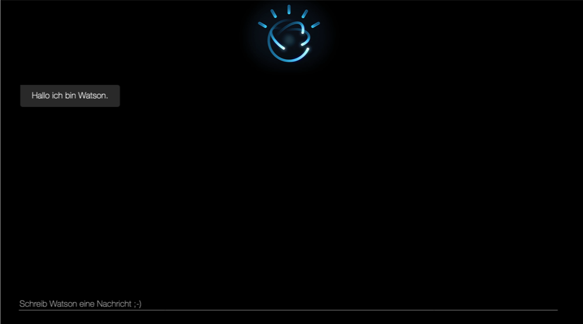

For further information and hands-on tutorials regarding the Watson APIs, please refer to my [colleague's repository](https://ibm.biz/eagdach_lab).

## If you have any questions just contact me
Felix Augenstein 
Digital Tech Ecosystem & Developer Representative @IBM 
Twitter: [@F_Augenstein](https://twitter.com/F_Augenstein) 
LinkedIn: [linkedin.com/in/felixaugenstein](https://www.linkedin.com/in/felixaugenstein/)
